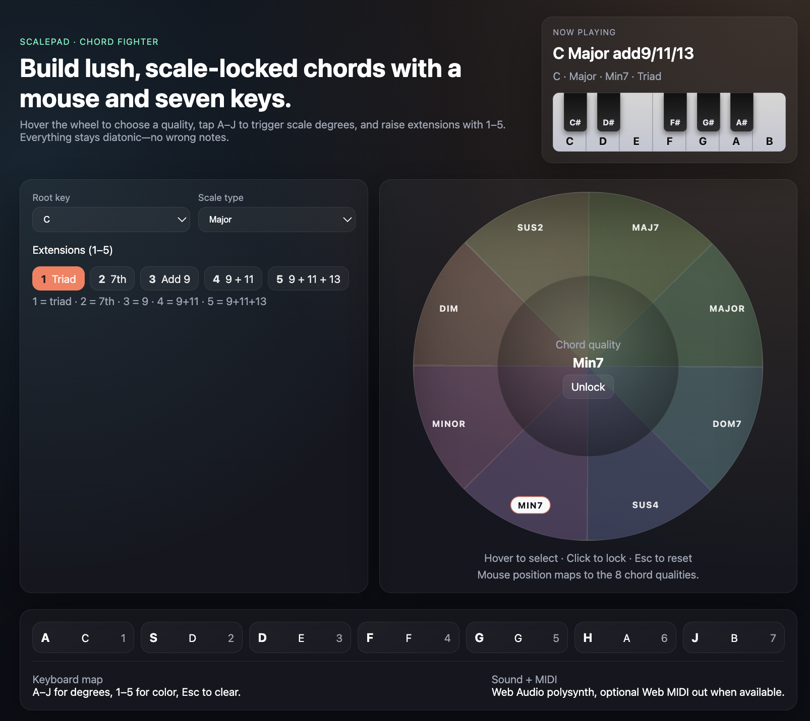

# ScalePad Chord Creator

Built for non-technical musicians: open and play right away. Visit the live app here:
https://jeffjassky.github.io/midi-chord-scale-pad/

- Preview:


- Pick a key + scale at the top.
- Hover the chord wheel to pick quality; click to lock it.
- Play the scale degrees with `A S D F G H J`.
- Add color with number keys `1–5` (Triad, 7th, add9, 9+11, 9+11+13).
- Watch the mini keyboard to see which notes are sounding.
- Sound comes from the built-in Web Audio polysynth; Web MIDI sends out if your browser allows it.

## Quick reference (controls)

- Chord wheel: hover to select, click to lock/unlock, Esc to reset.
- Keyboard: `A–J` = scale degrees 1–7, `1–5` = extensions, Esc = stop/unlock.
- Mouse: click the degree pads to audition without the keyboard.
- Status bar: shows current chord name and lights the played notes on the mini piano.

## Run locally (developers)

Prereqs: Node 18+ and npm.

```bash
npm install
npm run dev
# open http://localhost:5173
```

## Build for deployment

```bash
npm run build
# output in dist/ for static hosting or GitHub Pages
```

GitHub Pages workflow is included and targets `main`/`master`. Vite `base` is set for subpath hosting.

## Contributing

- Issues/ideas: open a ticket in this repo (jeffjassky/midi-chord-scale-pad).
- Code: fork, branch from `main`, keep changes focused, and add notes on manual testing.
- Style: Vue 3 + TypeScript + Vite. Prefer small, clear components and keep comments minimal but useful.
- Tests: none yet; manual check hover wheel, keyboard triggers, and Web MIDI fallback if available.
